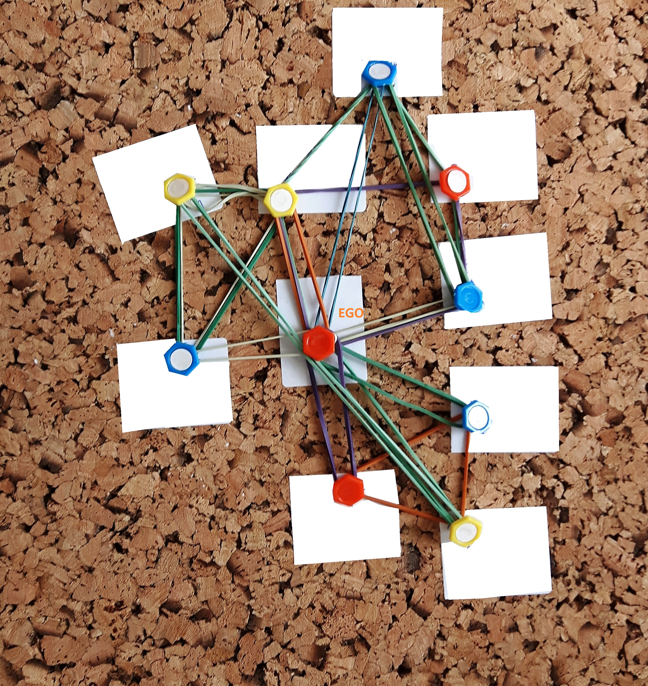

```{r setup, include = FALSE}
library(reconqdata)
library(dplyr)

knitr::opts_chunk$set(
  echo = FALSE,
  error = FALSE,
  warning = FALSE
)
```


# Introduction

Scientometric studies report steadily increasing trend in multi-authored scientific publications. It is clearly an evidence that contemporary science requires cooperation and is not anymore a traditionally individualistic activity [@moody2004structure]. The presented dataset comes from a study in which our overarching research goal was to understand why some scientist collaborate but some others do not. In particular, our approach was to think about *incentives* that might lead them to do so. Inspired by @coleman1994foundations and, among others, @lewis2012and we assume that the incentives to collaborate come from academically-relevant resources the scientists possess or control and the interests they might have in resources posessed or controlled by others. For example, a theorist and an experimentalist might be interested in each other's resources -- ability to develop theoretical model of the studied problem and skills in conducting experiments respecively. Unequal distribution of these resources across academic community and the necessity of pooling them to get ahead in contemporary science result in incentives to collaborate.

Current state of knowledge still lacks a universally accepted behavioral understanding of the scientific process, let alone standardized tools for measuring academically-relevant resources. Hence we conducted a qualitative study among Polish scientists with the goal to:

1. Collect egocentric data on collaborative relations.
2. Develop an inventory of academically-relevant resources from respondents' reports.
3. Measure what resources (item 2) collaborating parties (ego and alters) engage in their collaboration ties (item 1).

The data we hereby share is based on transcriptions and coding of the originally qualitative material. The study involved 40 interviews conducted on a sample of Polish scientists which we describe further in Section \@ref(sample). In Section \@ref(measurement) we describe the way in which the inventory of resources was constructed. A complete list with example quotes is provided in Appendix \@ref(resource-inventory). 


# Sample

Data comes from `r sum(nodes$is_ego)` Individual in-Depth Interviews (IDI) conducted between April and August 2016 by two interviewers. The quota sample consists of 20 female and 20 male scientists from six Polish cities. Respondents represented a broad range of disciplines: natural sciences, social sciences, life sciences, the humanities, engineering, and technology on different levels of career from PhD candidates to professors. The interviewees mentioned `r sum(!nodes$is_ego)` collaborators in total. Interviews lasting between 24 and 90 minutes were recorded and later transcribed.


# Measurement

Each interview consisted of several parts three of which are of relevance here:

1. Respondents were asked to name up to 10 important researchers they have collaborated with during last 5 years. Each collaborator was discussed separately giving information about gender, scientific degree, nationality, and university department (if possible). See Section \@ref(nodes) below.
2. During the interview a network of collaboration among collaborators mentioned in item (1) was reconstructed using corkboard, pins, and rubber bands. See the example in Figure \@ref(fig:corkboard). Corkboards were photographed and later digitized into edgelist data. See Section \@ref(collaboration) below.
3. For each collaborator the respondent was asked about academically-relevant resources he/she contributed to the collaboration and what resources were contributed by the collaborator. The text of the transcripts was analyzed using QDA Miner Lite^[A product of Provalis Research, see https://provalisresearch.com/products/qualitative-data-analysis-software/ .] in order to code resources engaged by respondents (the egos) and their collaborators (the alters) to every collaboration. The coding was performed by two persons. Random sample of the interviews was double-checked by different researchers to ensure reliability. See Section \@ref(resources) below.

While collaboration networks assembled from part (2) include alter-alter ties, the data on resources from part (3) was acquired for ego-alter dyads only.

```{r corkboard, fig.cap="Using corkboard, pins, and rubber bands to collect data on collaborations. Small cards contained names or nicknames which have been masked."}

```


# Data tables

The data is contained in three inter-related tables diagramatically presented in Figure \@ref(fig:data-model). Below we describe each table in detail.

```{r data-model-code, include=FALSE}
fname <- "data-model.png"
suppressPackageStartupMessages(plot_data_model()) %>%
  datamodelr::dm_render_graph(width=800) %>%
  DiagrammeRsvg::export_svg() %>%
  cat(file="dm.svg")
if(!file.exists(fname)) {
  dir.create(dirname(fname), recursive = TRUE)
  file.create(fname)
}
# Write a PNG
magick::image_read_svg("dm.svg") %>%
  magick::image_convert(format="png") %>%
  magick::image_write(path=fname)
unlink("dm.svg")
```

```{r data-model, fig.cap="Data model."}
knitr::include_graphics(fname)
```

## Node attributes {#nodes}

The table `nodes` contains information about every person in the study -- all egos and all alters. It has `r nrow(nodes)` rows and the following `r ncol(nodes)` variables:

- `id_interview` -- Interview identification number.
- `id_node` -- Person identification number, unique within each interview.
- `is_ego` -- Binary variable equal to 1 if person is the ego (respondent), 0 otherwise.
- `is_polish` -- Binary variable equal to 1 if person is affiliated with a Polish academic institution, 0 otherwise.
- `department` -- Marking scientists if they work at the same department. If `department` is not missing then all scientist within the same interview sharing the same value of `department` work at the same department at the same university.
- `scidegree` -- Scientific degree of the scientist. One of `"mgr"`=MA, `"dr"`=PhD, `"drhab"`=habilitated doctor, or `"prof"`=full professor.
- `female` -- Binary variable equal to 1 if person is female, 0 if male.

Pair of variables `id_interview` and `id_node` together constitute a key uniquelly identifying each row in the `nodes` table.


## Collaboration networks {#collaboration}

The table `collaboration` is essentially an edge list of collaboration ties. It has `r nrow(collaboration)` rows and the following `r ncol(collaboration)` variables:

- `id_interview` -- Interview identification number.
- `from` and `two` -- Person identification numbers referencing the `id_node` variable from the `nodes` table.

In other words a row consisting of values, say, `id_interview=1`, `from=2`, `to=3` indicates that researchers 2 and 3 where reported as collaborating in the interview 1.


## Resource contributions  {#resources}

Data about resources engaged by respondents (egos) and their collaborators (alters) to every collaboration was coded based on transcripts. The data is provided in table `resources` having
`r nrow(resources)` rows and the following `r ncol(resources)` columns:

- `id_interview` -- Interview identification number.
- `from` and `two` -- Person identification numbers (within each interview) referencing the `id_node` variable from the `nodes` table.
- `code` -- A textual code identifying type of resource contributed by researcher `from` into the collaboration with researcher `to`.

Resources engaged in collaborations (variable `code`) were coded with a coding scheme covering different elements of a research process in different disciplines. The scheme consists of `r nrow(reconqdata:::codes)` codes such as:

- 'Conceptualisation' - Coming up with an idea for a study, providing general theoretical framework; designing a general framework for a study;
- 'Methodology' - Designing methodology for a study;
- 'Investigation' - Conducting research, gathering data;
- 'Data analysis' - Data analysis, quantitative as well as qualitative;
- 'Data curation' - Managing and archiving data;
- 'Software creation' - Writing software for research process;
- 'Prototype construction'  - Building a prototype that is used in research process;

Complete list of codes together with examples of coded interview fragments is presented in Appendix \@ref(resource-inventory).


# Selected descriptives

Descriptives: freqs of female x scidegree x ego/alter:

```{r desc-freqs, R.options=list(knitr.kable.NA="--")}
nodes %>%
  count(female, scidegree, is_ego) %>%
  tidyr::spread(is_ego, n) %>%
  knitr::kable(
    caption = "Frequencies of gender and scientific degree."
  )
```

> Collaboration + resource nets from one of the interviews:


# Accessing the data

The data is available in a GitHub repository at https://github.com/recon-icm/reconqdata as an R package with accessible files in a CSV format. Users can use the data with R by installing the package or download the data files in CSV format using URLs provided in the README file.


# (APPENDIX) Appendix {-}

# Resource inventory {#resource-inventory}

```{r resource-inventory, results="asis"}
reconqdata:::resource_inventory2()
```


# References
